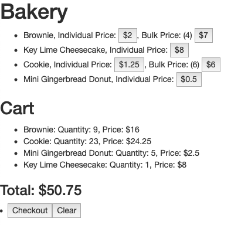
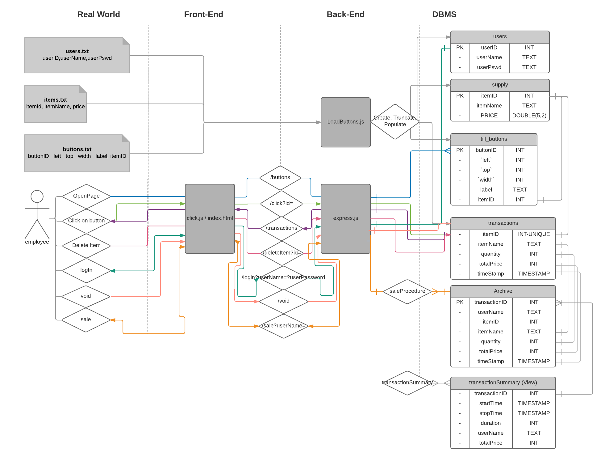

# Bakery Cash Register  

### How to run  
Once the repository is cloned, move `products-data.json` to the `resources` directory in the project directory. Then in two separate CLI's:  
```
lein figwheel   
lein run
```  
The app will be running at http://localhost:8080/.  

### Stack
This isn't the first time I have built a front to back clojure web app, but it is only the second time. I found a nice Leiningen [template](https://github.com/gered/simple-web-app-template) and started tinkering with that. This template, uses ring, compojure, and immutant on the back, and figwheel and reagent on the front.

I used Clojure's io for reading in the json file, and AJAX for the GET request on the front.

It is worth noting that most of the specific tooling is still new to me. I have played around with React and Reagent before, but only in small projects such as this. This has been a lot of learning, and a tremendous amount of fun!  

### Things for me to improve on
Given the short lead time, and the short lifespan of the code, I made certain trade offs. Here were some things, given more time I would address:  
* **Testing:**  Given the timeline, and short lifespan of the code, I didn't write any tests. That goes against every fiber of my being. However, I was able to validate my work via testing in the REPL.  
I tried setting up front end testing in a local branch, but the framework was new to me. With time constraints I wasn't able to integrate it into the stack.  
My preferred clojure test library is midje, and I am familiar with both Travis CI and Jenkins for continuous integration.  
* **Incorporating Databases:** Typically tills will check a database to make sure that what the user is trying to buy is actually in stock. Moreover, each till will write to the database once a sale is complete to update inventory. There are typically multiple tills trying read/write to a database. Below is an ERD diagram I made for a till program I made in a databases class. I wasn't about to implement all of this, but it would have been nice to use a database to keep an updated inventory.
* **Incorporating Pictures:** I would have been nice to the pictures in the JSON. I would have tried to make a separate element that reads from `@treats` and creates images.


